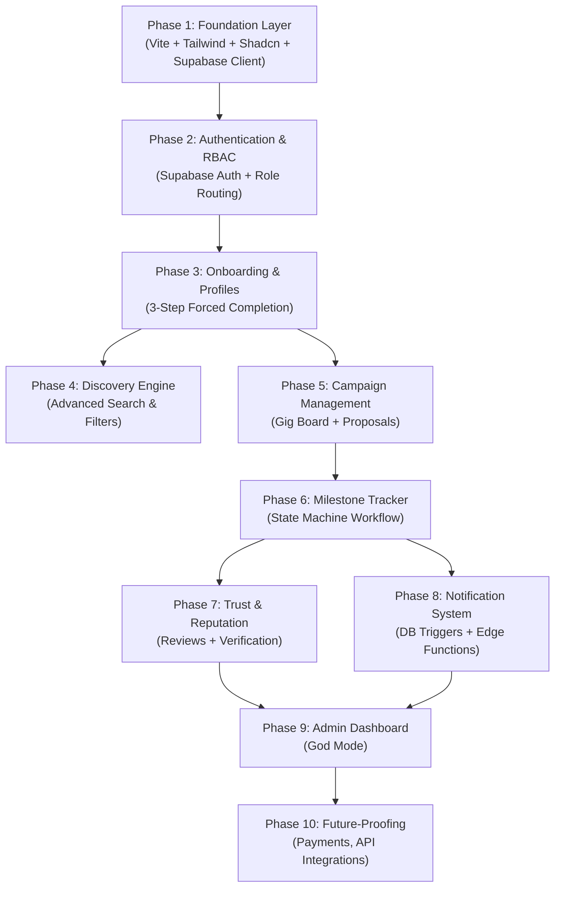
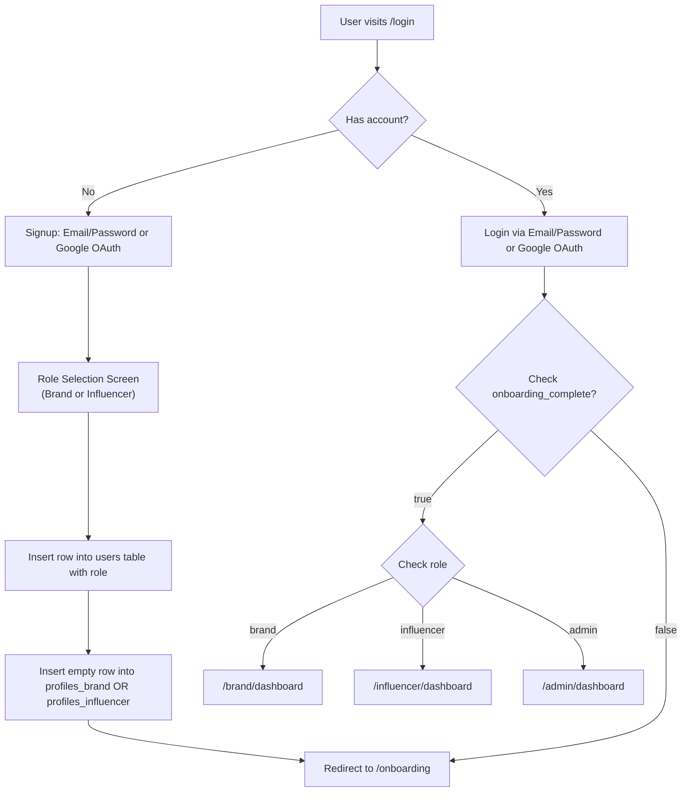
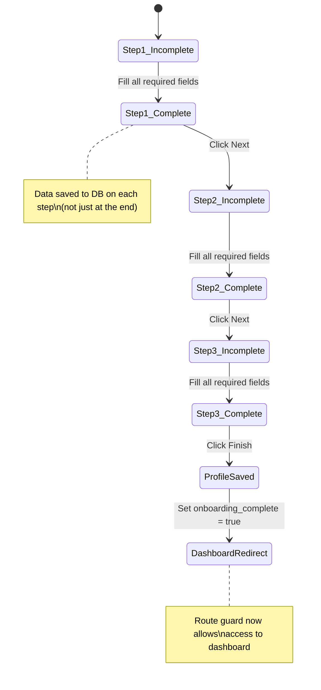
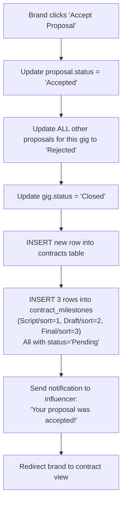
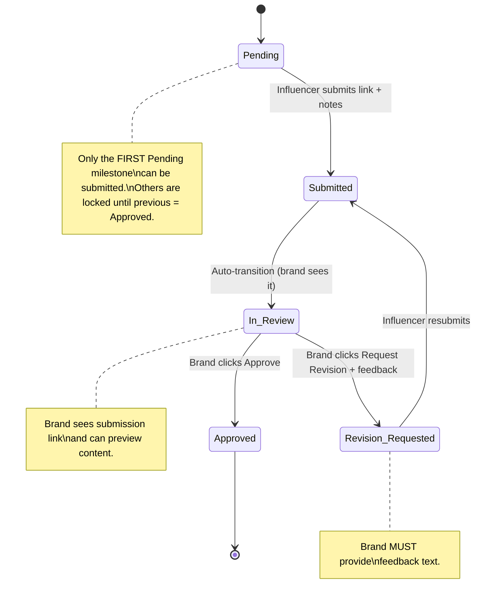
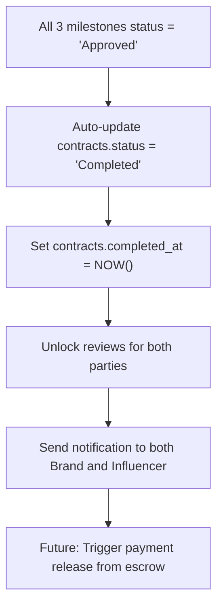
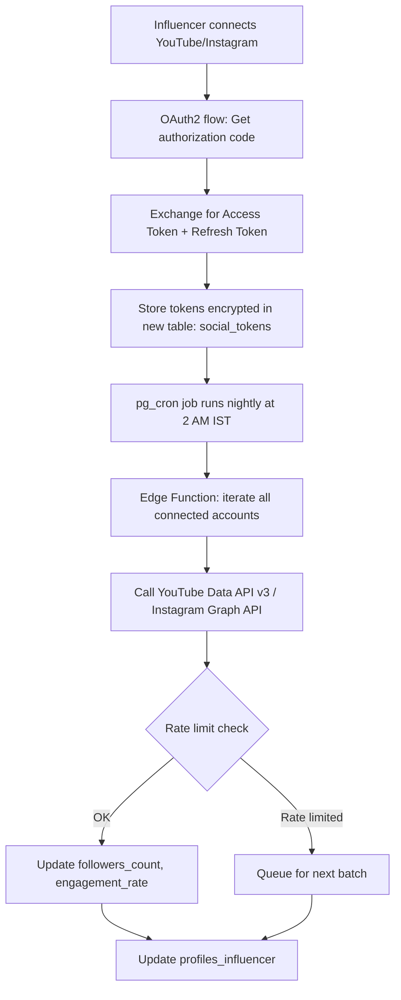
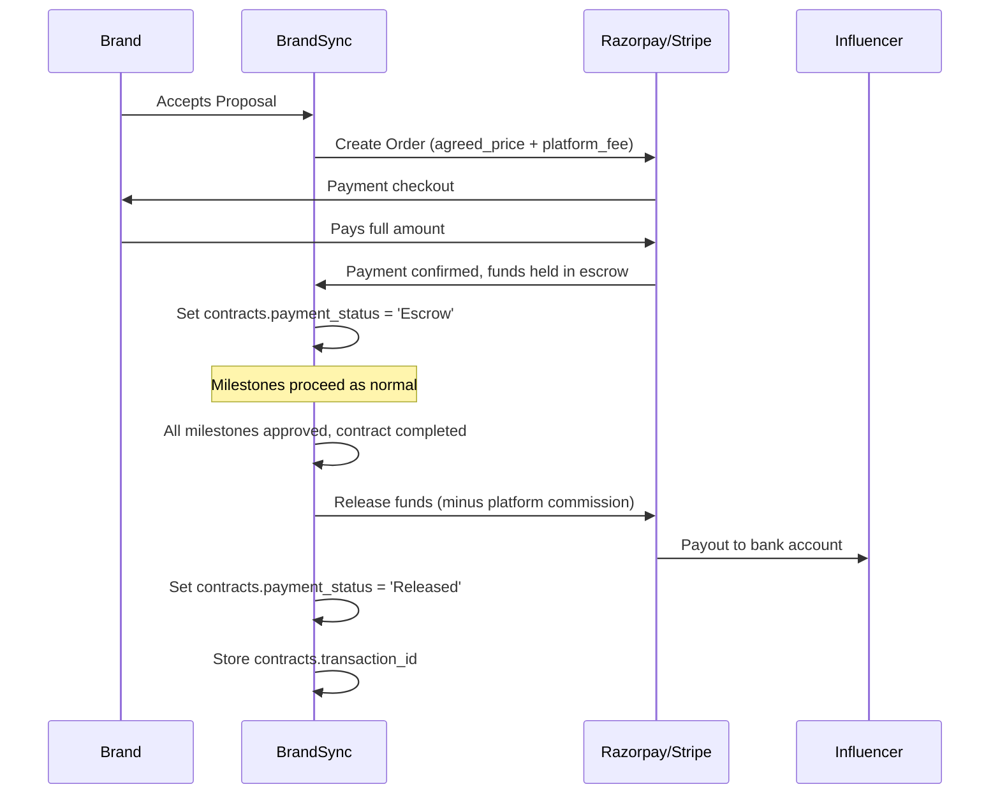

# BrandSync — Exhaustive Production Roadmap

> **Document Type:** Living Architecture Blueprint
> **Version:** 1.0.0 | **Last Updated:** 2026-03-02
> **Purpose:** Serve as the single source of truth for an AI coding IDE (Antigravity) to build BrandSync end-to-end. Structured by **Logical Dependency Flow**, not chronological schedule.

---

## Table of Contents

1. [Project Overview & Philosophy](#1-project-overview--philosophy)
2. [Tech Stack Deep Dive](#2-tech-stack-deep-dive)
3. [Database Architecture](#3-database-architecture)
4. [Phase 1 — Foundation Layer](#4-phase-1--foundation-layer)
5. [Phase 2 — Authentication & RBAC](#5-phase-2--authentication--rbac)
6. [Phase 3 — Onboarding & Profile System](#6-phase-3--onboarding--profile-system)
7. [Phase 4 — The Discovery Engine](#7-phase-4--the-discovery-engine)
8. [Phase 5 — Campaign Management & Proposal Handshake](#8-phase-5--campaign-management--proposal-handshake)
9. [Phase 6 — Milestone Workflow Tracker (Core USP)](#9-phase-6--milestone-workflow-tracker-core-usp)
10. [Phase 7 — Trust & Reputation System](#10-phase-7--trust--reputation-system)
11. [Phase 8 — Notification System (Retention Engine)](#11-phase-8--notification-system-retention-engine)
12. [Phase 9 — Admin "God Mode" Dashboard](#12-phase-9--admin-god-mode-dashboard)
13. [Phase 10 — Future-Proofing & Scalability](#13-phase-10--future-proofing--scalability)
14. [Component Architecture Map](#14-component-architecture-map)
15. [Deployment & CI/CD Pipeline](#15-deployment--cicd-pipeline)

---

## 1. Project Overview & Philosophy

### What is BrandSync?

BrandSync is an **End-to-End Influencer Marketing and Campaign Management SaaS** purpose-built for the **Indian SME market**. It is a two-sided marketplace connecting **Brands** (demand side) with **Micro-Influencers** (supply side).

### The 3 Core Pillars

| Pillar | Problem It Solves | How |
|---|---|---|
| **Discovery** | Brands waste hours finding the right influencer on Instagram/YouTube | Smart Search with filters (city, niche, language, budget, follower tier) |
| **Workflow** | Deals fall apart in messy WhatsApp/DM threads | Strict Milestone/Escrow Tracker with state machine logic |
| **Trust** | Fake followers, inflated stats, ghosting | Verified Analytics + 2-Way Review System |

### Business Model

- **Launch Phase:** Freemium MVP — zero cost for both sides. Goal: build network effects.
- **Monetization (V2):** Platform commission per deal via Stripe Connect / Razorpay Route.
- **Architectural Implication:** The database schema and UI must have **placeholders** for payment fields from Day 1. No schema migration hell later.

### Dependency Flow Diagram



---

## 2. Tech Stack Deep Dive

### Why Each Choice Matters

| Layer | Technology | Why This? |
|---|---|---|
| **Frontend Framework** | React.js (Vite) | Fastest DX, tree-shaking, HMR. Vite is 10-100x faster than CRA. |
| **Styling** | Tailwind CSS v3 | Utility-first, purges unused CSS, perfect for rapid prototyping. |
| **UI Components** | Shadcn UI + Aceternity UI | Shadcn gives accessible, composable primitives. Aceternity adds "Godly" motion/glassmorphism. |
| **Backend/DB/Auth/Storage** | Supabase (PostgreSQL) | Open-source Firebase alternative. RLS = security at the DB level. Realtime subscriptions built-in. |
| **Hosting** | Vercel | Zero-config deploys from GitHub. Edge network. Free tier generous. |
| **Background Jobs** | Supabase Edge Functions + `pg_cron` | Serverless functions for webhooks/emails. `pg_cron` for scheduled DB jobs. |
| **Transactional Email** | Resend | Modern email API, generous free tier (100 emails/day), React Email templates. |
| **Region** | `ap-south-1` (Mumbai) | Target market is India. Sub-50ms latency for Indian users. |

### Project Structure (Target)

```
brandsync/
├── public/
│   └── favicon.svg
├── src/
│   ├── assets/                    # Static images, icons
│   ├── components/
│   │   ├── ui/                    # Shadcn UI primitives (Button, Card, Input, etc.)
│   │   ├── layout/                # Sidebar, Topbar, PageWrapper
│   │   ├── discovery/             # SearchFilters, InfluencerCard, InfluencerGrid
│   │   ├── gigs/                  # GigCard, GigFeed, CreateGigForm
│   │   ├── proposals/             # ProposalCard, ProposalModal, KanbanColumn
│   │   ├── contracts/             # ContractCard, MilestoneCard, MilestoneStepper
│   │   ├── reviews/               # ReviewForm, StarRating, ReviewCard
│   │   ├── notifications/         # NotificationBell, NotificationItem
│   │   ├── onboarding/            # StepIndicator, BrandOnboard, InfluencerOnboard
│   │   └── admin/                 # UserTable, GigModerationPanel, AnalyticsChart
│   ├── hooks/                     # Custom React hooks (useAuth, useProfile, useGigs, etc.)
│   ├── lib/
│   │   ├── supabase.js            # Supabase client initialization
│   │   ├── constants.js           # Enums, config values
│   │   └── utils.js               # Helper functions (formatDate, truncateText, etc.)
│   ├── pages/
│   │   ├── auth/                  # Login, Signup, RoleSelect
│   │   ├── onboarding/            # OnboardingFlow
│   │   ├── brand/                 # BrandDashboard, PostGig, ManageApplications, ContractView
│   │   ├── influencer/            # InfluencerDashboard, GigFeed, MyProposals, ContractView
│   │   ├── shared/                # DiscoveryPage, ProfileView, ContractMilestones
│   │   └── admin/                 # AdminDashboard, UserManagement, GigModeration
│   ├── context/                   # AuthContext, ThemeContext
│   ├── routes/
│   │   ├── ProtectedRoute.jsx     # Auth guard
│   │   ├── RoleRoute.jsx          # Role-based guard
│   │   └── AppRouter.jsx          # Central router
│   ├── styles/
│   │   └── globals.css            # Tailwind directives + custom CSS variables
│   ├── App.jsx
│   └── main.jsx
├── supabase/
│   ├── migrations/                # SQL migration files (numbered)
│   ├── functions/                 # Edge Functions (send-email, nightly-sync, etc.)
│   └── seed.sql                   # Seed data for development
├── .env.local                     # VITE_SUPABASE_URL, VITE_SUPABASE_ANON_KEY
├── tailwind.config.js
├── vite.config.js
├── vercel.json
├── package.json
└── README.md
```

---

## 3. Database Architecture

### 3.1 Entity-Relationship Diagram

```mermaid
erDiagram
    USERS {
        uuid user_id PK
        text email UK
        enum role "brand | influencer | admin"
        boolean is_active "default true"
        timestamp created_at
        timestamp updated_at
    }

    PROFILES_BRAND {
        uuid id PK
        uuid user_id FK UK
        text company_name
        text industry
        text location
        text logo_url
        text website
        text description
        boolean onboarding_complete "default false"
        timestamp created_at
        timestamp updated_at
    }

    PROFILES_INFLUENCER {
        uuid id PK
        uuid user_id FK UK
        text full_name
        text niche
        text city
        text language
        integer followers_count
        decimal engagement_rate
        decimal price_per_post
        text bio
        text avatar_url
        boolean is_verified "default false"
        text platform_primary "instagram | youtube | both"
        text instagram_handle
        text youtube_handle
        boolean onboarding_complete "default false"
        timestamp created_at
        timestamp updated_at
    }

    GIGS {
        uuid id PK
        uuid brand_id FK
        text title
        text description
        decimal budget
        enum platform "Instagram | YouTube | Both"
        text niche_required
        text city_preferred
        text language_preferred
        int follower_min
        int follower_max
        enum status "Open | Closed | Cancelled"
        timestamp created_at
        timestamp updated_at
    }

    PROPOSALS {
        uuid id PK
        uuid gig_id FK
        uuid influencer_id FK
        text cover_letter
        decimal quoted_price
        enum status "Pending | Accepted | Rejected | Withdrawn"
        timestamp created_at
        timestamp updated_at
    }

    CONTRACTS {
        uuid id PK
        uuid gig_id FK
        uuid influencer_id FK
        uuid brand_id FK
        decimal agreed_price
        enum status "Active | Completed | Cancelled | Disputed"
        enum payment_status "Unpaid | Escrow | Released | Refunded"
        text transaction_id "nullable - future Razorpay/Stripe"
        text payment_gateway "nullable - future razorpay | stripe"
        timestamp started_at
        timestamp completed_at
        timestamp created_at
        timestamp updated_at
    }

    CONTRACT_MILESTONES {
        uuid id PK
        uuid contract_id FK
        text milestone_name "Script | Draft | Final"
        int sort_order "1, 2, 3"
        enum status "Pending | Submitted | In_Review | Approved | Revision_Requested"
        text submission_link "nullable"
        text submission_notes "nullable"
        text brand_feedback "nullable"
        timestamp submitted_at
        timestamp reviewed_at
        timestamp created_at
        timestamp updated_at
    }

    REVIEWS {
        uuid id PK
        uuid contract_id FK
        uuid reviewer_id FK
        uuid target_id FK
        int rating "1-5, CHECK constraint"
        text comment
        enum reviewer_role "brand | influencer"
        timestamp created_at
    }

    NOTIFICATIONS {
        uuid id PK
        uuid user_id FK
        text title
        text message
        text type "proposal_received | milestone_update | contract_completed | review_received | system"
        text link "nullable - deep link to relevant page"
        boolean is_read "default false"
        timestamp created_at
    }

    VERIFICATION_PROOFS {
        uuid id PK
        uuid influencer_id FK
        text platform "instagram | youtube"
        text proof_url "Supabase Storage path"
        enum status "Pending | Approved | Rejected"
        text admin_notes "nullable"
        timestamp submitted_at
        timestamp reviewed_at
    }

    USERS ||--o| PROFILES_BRAND : "has (if role=brand)"
    USERS ||--o| PROFILES_INFLUENCER : "has (if role=influencer)"
    USERS ||--o{ NOTIFICATIONS : "receives"
    PROFILES_BRAND ||--o{ GIGS : "posts"
    GIGS ||--o{ PROPOSALS : "receives"
    PROFILES_INFLUENCER ||--o{ PROPOSALS : "submits"
    GIGS ||--o| CONTRACTS : "generates"
    CONTRACTS ||--o{ CONTRACT_MILESTONES : "has 3"
    CONTRACTS ||--o{ REVIEWS : "unlocks on completion"
    PROFILES_INFLUENCER ||--o{ VERIFICATION_PROOFS : "submits"
```

### 3.2 SQL Schema (Migration 001)

```sql
-- Migration: 001_initial_schema.sql
-- Description: Creates all core tables for BrandSync MVP

-- Enable UUID generation
CREATE EXTENSION IF NOT EXISTS "uuid-ossp";

-- ======================
-- CUSTOM TYPES (ENUMS)
-- ======================
CREATE TYPE user_role AS ENUM ('brand', 'influencer', 'admin');
CREATE TYPE gig_platform AS ENUM ('Instagram', 'YouTube', 'Both');
CREATE TYPE gig_status AS ENUM ('Open', 'Closed', 'Cancelled');
CREATE TYPE proposal_status AS ENUM ('Pending', 'Accepted', 'Rejected', 'Withdrawn');
CREATE TYPE contract_status AS ENUM ('Active', 'Completed', 'Cancelled', 'Disputed');
CREATE TYPE payment_status AS ENUM ('Unpaid', 'Escrow', 'Released', 'Refunded');
CREATE TYPE milestone_name AS ENUM ('Script', 'Draft', 'Final');
CREATE TYPE milestone_status AS ENUM ('Pending', 'Submitted', 'In_Review', 'Approved', 'Revision_Requested');
CREATE TYPE verification_status AS ENUM ('Pending', 'Approved', 'Rejected');
CREATE TYPE reviewer_role AS ENUM ('brand', 'influencer');

-- ======================
-- TABLE: users
-- ======================
-- Why: Central identity table. Extends Supabase auth.users with app-specific role.
-- The user_id here maps 1:1 to auth.users.id from Supabase Auth.
CREATE TABLE users (
    user_id UUID PRIMARY KEY DEFAULT uuid_generate_v4(),
    email TEXT UNIQUE NOT NULL,
    role user_role NOT NULL,
    is_active BOOLEAN DEFAULT TRUE,
    created_at TIMESTAMPTZ DEFAULT NOW(),
    updated_at TIMESTAMPTZ DEFAULT NOW()
);

-- ======================
-- TABLE: profiles_brand
-- ======================
-- Why: Separate profile table for brands. Decoupled from users so we can add
-- brand-specific fields without polluting the core identity table.
CREATE TABLE profiles_brand (
    id UUID PRIMARY KEY DEFAULT uuid_generate_v4(),
    user_id UUID UNIQUE NOT NULL REFERENCES users(user_id) ON DELETE CASCADE,
    company_name TEXT,
    industry TEXT,
    location TEXT,
    logo_url TEXT,
    website TEXT,
    description TEXT,
    onboarding_complete BOOLEAN DEFAULT FALSE,
    created_at TIMESTAMPTZ DEFAULT NOW(),
    updated_at TIMESTAMPTZ DEFAULT NOW()
);

-- ======================
-- TABLE: profiles_influencer
-- ======================
-- Why: Separate profile table for influencers with social-media-specific fields.
-- followers_count and engagement_rate will be manually entered in MVP,
-- then auto-synced via API in V2.
CREATE TABLE profiles_influencer (
    id UUID PRIMARY KEY DEFAULT uuid_generate_v4(),
    user_id UUID UNIQUE NOT NULL REFERENCES users(user_id) ON DELETE CASCADE,
    full_name TEXT,
    niche TEXT,
    city TEXT,
    language TEXT,
    followers_count INTEGER DEFAULT 0,
    engagement_rate DECIMAL(5,2) DEFAULT 0.00,
    price_per_post DECIMAL(10,2),
    bio TEXT,
    avatar_url TEXT,
    is_verified BOOLEAN DEFAULT FALSE,
    platform_primary TEXT DEFAULT 'instagram',
    instagram_handle TEXT,
    youtube_handle TEXT,
    onboarding_complete BOOLEAN DEFAULT FALSE,
    created_at TIMESTAMPTZ DEFAULT NOW(),
    updated_at TIMESTAMPTZ DEFAULT NOW()
);

-- ======================
-- TABLE: gigs
-- ======================
-- Why: The "job board" for brands to post campaign requirements.
-- follower_min/max enable range-based filtering in Discovery.
CREATE TABLE gigs (
    id UUID PRIMARY KEY DEFAULT uuid_generate_v4(),
    brand_id UUID NOT NULL REFERENCES users(user_id) ON DELETE CASCADE,
    title TEXT NOT NULL,
    description TEXT NOT NULL,
    budget DECIMAL(10,2) NOT NULL,
    platform gig_platform NOT NULL DEFAULT 'Instagram',
    niche_required TEXT,
    city_preferred TEXT,
    language_preferred TEXT,
    follower_min INTEGER DEFAULT 0,
    follower_max INTEGER DEFAULT 999999999,
    status gig_status DEFAULT 'Open',
    created_at TIMESTAMPTZ DEFAULT NOW(),
    updated_at TIMESTAMPTZ DEFAULT NOW()
);

-- ======================
-- TABLE: proposals
-- ======================
-- Why: Bridge table between gigs and influencers. An influencer "applies" to a gig.
-- Unique constraint prevents duplicate applications.
CREATE TABLE proposals (
    id UUID PRIMARY KEY DEFAULT uuid_generate_v4(),
    gig_id UUID NOT NULL REFERENCES gigs(id) ON DELETE CASCADE,
    influencer_id UUID NOT NULL REFERENCES users(user_id) ON DELETE CASCADE,
    cover_letter TEXT,
    quoted_price DECIMAL(10,2) NOT NULL,
    status proposal_status DEFAULT 'Pending',
    created_at TIMESTAMPTZ DEFAULT NOW(),
    updated_at TIMESTAMPTZ DEFAULT NOW(),
    UNIQUE(gig_id, influencer_id)
);

-- ======================
-- TABLE: contracts
-- ======================
-- Why: Created when a brand accepts a proposal. This is the "active deal."
-- payment_status and transaction_id are placeholders for Razorpay/Stripe V2.
CREATE TABLE contracts (
    id UUID PRIMARY KEY DEFAULT uuid_generate_v4(),
    gig_id UUID NOT NULL REFERENCES gigs(id),
    influencer_id UUID NOT NULL REFERENCES users(user_id),
    brand_id UUID NOT NULL REFERENCES users(user_id),
    agreed_price DECIMAL(10,2) NOT NULL,
    status contract_status DEFAULT 'Active',
    payment_status payment_status DEFAULT 'Unpaid',
    transaction_id TEXT,
    payment_gateway TEXT,
    started_at TIMESTAMPTZ DEFAULT NOW(),
    completed_at TIMESTAMPTZ,
    created_at TIMESTAMPTZ DEFAULT NOW(),
    updated_at TIMESTAMPTZ DEFAULT NOW()
);

-- ======================
-- TABLE: contract_milestones
-- ======================
-- Why: The heart of BrandSync's USP. Every contract gets exactly 3 milestones.
-- sort_order enforces sequential progression.
-- The state machine: Pending -> Submitted -> In_Review -> Approved | Revision_Requested
CREATE TABLE contract_milestones (
    id UUID PRIMARY KEY DEFAULT uuid_generate_v4(),
    contract_id UUID NOT NULL REFERENCES contracts(id) ON DELETE CASCADE,
    milestone_name milestone_name NOT NULL,
    sort_order INTEGER NOT NULL CHECK (sort_order BETWEEN 1 AND 3),
    status milestone_status DEFAULT 'Pending',
    submission_link TEXT,
    submission_notes TEXT,
    brand_feedback TEXT,
    submitted_at TIMESTAMPTZ,
    reviewed_at TIMESTAMPTZ,
    created_at TIMESTAMPTZ DEFAULT NOW(),
    updated_at TIMESTAMPTZ DEFAULT NOW(),
    UNIQUE(contract_id, sort_order)
);

-- ======================
-- TABLE: reviews
-- ======================
-- Why: 2-way review system. Both brand and influencer can review each other
-- ONLY after contract is completed. CHECK constraint enforces rating range.
-- Unique constraint prevents duplicate reviews.
CREATE TABLE reviews (
    id UUID PRIMARY KEY DEFAULT uuid_generate_v4(),
    contract_id UUID NOT NULL REFERENCES contracts(id) ON DELETE CASCADE,
    reviewer_id UUID NOT NULL REFERENCES users(user_id),
    target_id UUID NOT NULL REFERENCES users(user_id),
    rating INTEGER NOT NULL CHECK (rating BETWEEN 1 AND 5),
    comment TEXT,
    reviewer_role reviewer_role NOT NULL,
    created_at TIMESTAMPTZ DEFAULT NOW(),
    UNIQUE(contract_id, reviewer_id)
);

-- ======================
-- TABLE: notifications
-- ======================
-- Why: In-app notification feed. Each state change triggers a notification insert.
-- link field enables deep-linking to the relevant page from the notification bell.
CREATE TABLE notifications (
    id UUID PRIMARY KEY DEFAULT uuid_generate_v4(),
    user_id UUID NOT NULL REFERENCES users(user_id) ON DELETE CASCADE,
    title TEXT NOT NULL,
    message TEXT NOT NULL,
    type TEXT NOT NULL DEFAULT 'system',
    link TEXT,
    is_read BOOLEAN DEFAULT FALSE,
    created_at TIMESTAMPTZ DEFAULT NOW()
);

-- ======================
-- TABLE: verification_proofs
-- ======================
-- Why: MVP uses manual screenshot verification. This table stores proof uploads
-- and admin approval status. In V2, this table will also store API-fetched data.
CREATE TABLE verification_proofs (
    id UUID PRIMARY KEY DEFAULT uuid_generate_v4(),
    influencer_id UUID NOT NULL REFERENCES users(user_id) ON DELETE CASCADE,
    platform TEXT NOT NULL,
    proof_url TEXT NOT NULL,
    status verification_status DEFAULT 'Pending',
    admin_notes TEXT,
    submitted_at TIMESTAMPTZ DEFAULT NOW(),
    reviewed_at TIMESTAMPTZ
);

-- ======================
-- INDEXES (Performance)
-- ======================
CREATE INDEX idx_gigs_status ON gigs(status);
CREATE INDEX idx_gigs_brand_id ON gigs(brand_id);
CREATE INDEX idx_gigs_niche ON gigs(niche_required);
CREATE INDEX idx_proposals_gig_id ON proposals(gig_id);
CREATE INDEX idx_proposals_influencer_id ON proposals(influencer_id);
CREATE INDEX idx_contracts_brand_id ON contracts(brand_id);
CREATE INDEX idx_contracts_influencer_id ON contracts(influencer_id);
CREATE INDEX idx_milestones_contract_id ON contract_milestones(contract_id);
CREATE INDEX idx_notifications_user_id ON notifications(user_id);
CREATE INDEX idx_notifications_is_read ON notifications(is_read);
CREATE INDEX idx_influencer_niche ON profiles_influencer(niche);
CREATE INDEX idx_influencer_city ON profiles_influencer(city);
CREATE INDEX idx_influencer_followers ON profiles_influencer(followers_count);

-- ======================
-- TRIGGERS: auto-update updated_at
-- ======================
CREATE OR REPLACE FUNCTION update_updated_at_column()
RETURNS TRIGGER AS $$
BEGIN
    NEW.updated_at = NOW();
    RETURN NEW;
END;
$$ LANGUAGE plpgsql;

CREATE TRIGGER trg_users_updated_at BEFORE UPDATE ON users
    FOR EACH ROW EXECUTE FUNCTION update_updated_at_column();
CREATE TRIGGER trg_profiles_brand_updated_at BEFORE UPDATE ON profiles_brand
    FOR EACH ROW EXECUTE FUNCTION update_updated_at_column();
CREATE TRIGGER trg_profiles_influencer_updated_at BEFORE UPDATE ON profiles_influencer
    FOR EACH ROW EXECUTE FUNCTION update_updated_at_column();
CREATE TRIGGER trg_gigs_updated_at BEFORE UPDATE ON gigs
    FOR EACH ROW EXECUTE FUNCTION update_updated_at_column();
CREATE TRIGGER trg_proposals_updated_at BEFORE UPDATE ON proposals
    FOR EACH ROW EXECUTE FUNCTION update_updated_at_column();
CREATE TRIGGER trg_contracts_updated_at BEFORE UPDATE ON contracts
    FOR EACH ROW EXECUTE FUNCTION update_updated_at_column();
CREATE TRIGGER trg_milestones_updated_at BEFORE UPDATE ON contract_milestones
    FOR EACH ROW EXECUTE FUNCTION update_updated_at_column();
```

### 3.3 Row Level Security (RLS) Policies

> **Why RLS?** Supabase exposes the PostgreSQL database directly to the frontend via the `anon` key. Without RLS, *any* authenticated user could read/write *any* row. RLS enforces security **at the database level**, making it impossible to bypass even if the frontend is compromised.

```sql
-- ======================
-- RLS: Enable on ALL tables
-- ======================
ALTER TABLE users ENABLE ROW LEVEL SECURITY;
ALTER TABLE profiles_brand ENABLE ROW LEVEL SECURITY;
ALTER TABLE profiles_influencer ENABLE ROW LEVEL SECURITY;
ALTER TABLE gigs ENABLE ROW LEVEL SECURITY;
ALTER TABLE proposals ENABLE ROW LEVEL SECURITY;
ALTER TABLE contracts ENABLE ROW LEVEL SECURITY;
ALTER TABLE contract_milestones ENABLE ROW LEVEL SECURITY;
ALTER TABLE reviews ENABLE ROW LEVEL SECURITY;
ALTER TABLE notifications ENABLE ROW LEVEL SECURITY;
ALTER TABLE verification_proofs ENABLE ROW LEVEL SECURITY;

-- ======================
-- POLICY: users
-- ======================
-- Users can read their own row. Admins can read all.
CREATE POLICY "Users can view own data" ON users
    FOR SELECT USING (auth.uid() = user_id);
CREATE POLICY "Users can update own data" ON users
    FOR UPDATE USING (auth.uid() = user_id);

-- ======================
-- POLICY: profiles_brand
-- ======================
-- Brands can CRUD their own profile. Everyone can READ brand profiles (for discovery).
CREATE POLICY "Anyone can view brand profiles" ON profiles_brand
    FOR SELECT USING (true);
CREATE POLICY "Brands can update own profile" ON profiles_brand
    FOR UPDATE USING (auth.uid() = user_id);
CREATE POLICY "Brands can insert own profile" ON profiles_brand
    FOR INSERT WITH CHECK (auth.uid() = user_id);

-- ======================
-- POLICY: profiles_influencer
-- ======================
-- Influencers can CRUD their own profile. Everyone can READ (for discovery search).
CREATE POLICY "Anyone can view influencer profiles" ON profiles_influencer
    FOR SELECT USING (true);
CREATE POLICY "Influencers can update own profile" ON profiles_influencer
    FOR UPDATE USING (auth.uid() = user_id);
CREATE POLICY "Influencers can insert own profile" ON profiles_influencer
    FOR INSERT WITH CHECK (auth.uid() = user_id);

-- ======================
-- POLICY: gigs
-- ======================
-- Anyone authenticated can VIEW open gigs. Only the brand owner can UPDATE/DELETE.
CREATE POLICY "Anyone can view open gigs" ON gigs
    FOR SELECT USING (status = 'Open' OR brand_id = auth.uid());
CREATE POLICY "Brands can insert gigs" ON gigs
    FOR INSERT WITH CHECK (auth.uid() = brand_id);
CREATE POLICY "Brands can update own gigs" ON gigs
    FOR UPDATE USING (auth.uid() = brand_id);

-- ======================
-- POLICY: proposals
-- ======================
-- Influencers can insert proposals. Brand (gig owner) and the influencer can view.
CREATE POLICY "Proposal participants can view" ON proposals
    FOR SELECT USING (
        auth.uid() = influencer_id
        OR auth.uid() IN (SELECT brand_id FROM gigs WHERE gigs.id = proposals.gig_id)
    );
CREATE POLICY "Influencers can insert proposals" ON proposals
    FOR INSERT WITH CHECK (auth.uid() = influencer_id);
CREATE POLICY "Influencers can update own proposals" ON proposals
    FOR UPDATE USING (auth.uid() = influencer_id);

-- ======================
-- POLICY: contracts
-- ======================
-- Only the brand and influencer in the contract can view/update.
CREATE POLICY "Contract parties can view" ON contracts
    FOR SELECT USING (auth.uid() = brand_id OR auth.uid() = influencer_id);
CREATE POLICY "Contract parties can update" ON contracts
    FOR UPDATE USING (auth.uid() = brand_id OR auth.uid() = influencer_id);

-- ======================
-- POLICY: contract_milestones
-- ======================
-- Accessible to both parties of the parent contract.
CREATE POLICY "Milestone parties can view" ON contract_milestones
    FOR SELECT USING (
        auth.uid() IN (
            SELECT brand_id FROM contracts WHERE contracts.id = contract_milestones.contract_id
            UNION
            SELECT influencer_id FROM contracts WHERE contracts.id = contract_milestones.contract_id
        )
    );
CREATE POLICY "Influencer can submit milestones" ON contract_milestones
    FOR UPDATE USING (
        auth.uid() IN (
            SELECT influencer_id FROM contracts WHERE contracts.id = contract_milestones.contract_id
        )
    );

-- ======================
-- POLICY: reviews
-- ======================
-- Anyone can read reviews. Only authenticated parties can insert.
CREATE POLICY "Anyone can view reviews" ON reviews
    FOR SELECT USING (true);
CREATE POLICY "Contract parties can insert reviews" ON reviews
    FOR INSERT WITH CHECK (
        auth.uid() = reviewer_id
        AND auth.uid() IN (
            SELECT brand_id FROM contracts WHERE contracts.id = reviews.contract_id
            UNION
            SELECT influencer_id FROM contracts WHERE contracts.id = reviews.contract_id
        )
    );

-- ======================
-- POLICY: notifications
-- ======================
-- Users can only see and update their own notifications.
CREATE POLICY "Users see own notifications" ON notifications
    FOR SELECT USING (auth.uid() = user_id);
CREATE POLICY "Users can mark own notifications read" ON notifications
    FOR UPDATE USING (auth.uid() = user_id);

-- ======================
-- POLICY: verification_proofs
-- ======================
-- Influencers can insert/view their own. Admins can view/update all (handled via service_role key).
CREATE POLICY "Influencers can view own proofs" ON verification_proofs
    FOR SELECT USING (auth.uid() = influencer_id);
CREATE POLICY "Influencers can insert proofs" ON verification_proofs
    FOR INSERT WITH CHECK (auth.uid() = influencer_id);
```

---

## 4. Phase 1 — Foundation Layer

> **Dependency:** None. This is the starting point.
> **Goal:** Set up the project scaffold, install all dependencies, configure Supabase client, and establish the design system.

### 4.1 Tasks

| # | Task | Files Created/Modified | Why |
|---|---|---|---|
| 1 | Initialize Vite + React project | `vite.config.js`, `package.json`, `main.jsx`, `App.jsx` | Vite gives sub-second HMR and optimized builds. |
| 2 | Install & configure Tailwind CSS | `tailwind.config.js`, `globals.css` | Utility-first CSS for rapid prototyping. |
| 3 | Install Shadcn UI | `components/ui/*` | Accessible, composable UI primitives. |
| 4 | Install Aceternity UI components | Selected components only | "Godly" aesthetic: glassmorphism cards, particle backgrounds, text animations. |
| 5 | Configure Supabase client | `src/lib/supabase.js` | Singleton client instance used across the app. |
| 6 | Set up environment variables | `.env.local` | `VITE_SUPABASE_URL`, `VITE_SUPABASE_ANON_KEY` |
| 7 | Create base layout components | `Sidebar.jsx`, `Topbar.jsx`, `PageWrapper.jsx` | Consistent dashboard shell across all views. |
| 8 | Set up React Router v6 | `AppRouter.jsx`, route files | Client-side routing foundation. |
| 9 | Configure Dark Mode | `ThemeContext.jsx`, `globals.css` | Dark mode as default for B2B SaaS aesthetic. |

### 4.2 Supabase Client Setup

```javascript
// src/lib/supabase.js
import { createClient } from '@supabase/supabase-js';

const supabaseUrl = import.meta.env.VITE_SUPABASE_URL;
const supabaseAnonKey = import.meta.env.VITE_SUPABASE_ANON_KEY;

if (!supabaseUrl || !supabaseAnonKey) {
  throw new Error('Missing Supabase environment variables. Check .env.local');
}

export const supabase = createClient(supabaseUrl, supabaseAnonKey, {
  auth: {
    autoRefreshToken: true,
    persistSession: true,
    detectSessionInUrl: true, // Required for OAuth redirects
  },
  db: {
    schema: 'public',
  },
});
```

### 4.3 Design System Tokens

```css
/* src/styles/globals.css */
@tailwind base;
@tailwind components;
@tailwind utilities;

@layer base {
  :root {
    /* Light Mode */
    --background: 0 0% 100%;
    --foreground: 222.2 84% 4.9%;
    --card: 0 0% 100%;
    --card-foreground: 222.2 84% 4.9%;
    --primary: 262 83% 58%;        /* BrandSync Purple */
    --primary-foreground: 210 40% 98%;
    --secondary: 210 40% 96.1%;
    --accent: 174 72% 56%;          /* Teal accent */
    --muted: 210 40% 96.1%;
    --border: 214.3 31.8% 91.4%;
    --radius: 0.75rem;
  }

  .dark {
    --background: 222.2 84% 4.9%;
    --foreground: 210 40% 98%;
    --card: 217.2 32.6% 10%;
    --card-foreground: 210 40% 98%;
    --primary: 262 83% 68%;
    --primary-foreground: 222.2 47.4% 11.2%;
    --secondary: 217.2 32.6% 17.5%;
    --accent: 174 72% 56%;
    --muted: 217.2 32.6% 17.5%;
    --border: 217.2 32.6% 20%;
  }
}
```

---

## 5. Phase 2 — Authentication & RBAC

> **Dependency:** Phase 1 (Foundation Layer must be complete).
> **Goal:** Implement secure authentication with strict role-based routing. A brand user must NEVER see influencer-only routes and vice versa.

### 5.1 Authentication Flow



### 5.2 Auth Context Provider

```jsx
// src/context/AuthContext.jsx
import { createContext, useContext, useEffect, useState } from 'react';
import { supabase } from '../lib/supabase';

const AuthContext = createContext({});

export const AuthProvider = ({ children }) => {
  const [user, setUser] = useState(null);        // Supabase auth user
  const [profile, setProfile] = useState(null);  // App profile (brand or influencer)
  const [role, setRole] = useState(null);         // 'brand' | 'influencer' | 'admin'
  const [loading, setLoading] = useState(true);

  useEffect(() => {
    // 1. Get initial session
    supabase.auth.getSession().then(({ data: { session } }) => {
      if (session?.user) {
        setUser(session.user);
        fetchUserRole(session.user.id);
      }
      setLoading(false);
    });

    // 2. Listen for auth state changes (login, logout, token refresh)
    const { data: { subscription } } = supabase.auth.onAuthStateChange(
      async (event, session) => {
        if (session?.user) {
          setUser(session.user);
          await fetchUserRole(session.user.id);
        } else {
          setUser(null);
          setProfile(null);
          setRole(null);
        }
        setLoading(false);
      }
    );

    return () => subscription.unsubscribe();
  }, []);

  const fetchUserRole = async (userId) => {
    const { data, error } = await supabase
      .from('users')
      .select('role')
      .eq('user_id', userId)
      .single();

    if (data) {
      setRole(data.role);
      // Fetch the appropriate profile based on role
      if (data.role === 'brand') {
        const { data: brandProfile } = await supabase
          .from('profiles_brand')
          .select('*')
          .eq('user_id', userId)
          .single();
        setProfile(brandProfile);
      } else if (data.role === 'influencer') {
        const { data: influencerProfile } = await supabase
          .from('profiles_influencer')
          .select('*')
          .eq('user_id', userId)
          .single();
        setProfile(influencerProfile);
      }
    }
  };

  const signOut = async () => {
    await supabase.auth.signOut();
    setUser(null);
    setProfile(null);
    setRole(null);
  };

  return (
    <AuthContext.Provider value={{
      user, profile, role, loading,
      signOut, refreshProfile: () => fetchUserRole(user?.id)
    }}>
      {children}
    </AuthContext.Provider>
  );
};

export const useAuth = () => useContext(AuthContext);
```

### 5.3 Protected Route Components

```jsx
// src/routes/ProtectedRoute.jsx
// Why: Prevents unauthenticated users from accessing any dashboard route.
import { Navigate } from 'react-router-dom';
import { useAuth } from '../context/AuthContext';

export const ProtectedRoute = ({ children }) => {
  const { user, loading } = useAuth();
  if (loading) return <LoadingSpinner />;
  if (!user) return <Navigate to="/login" replace />;
  return children;
};

// src/routes/RoleRoute.jsx
// Why: Prevents role violations. An influencer hitting /brand/* gets redirected.
// This is CRITICAL for security — never rely on just hiding UI elements.
export const RoleRoute = ({ allowedRoles, children }) => {
  const { role, profile, loading } = useAuth();
  if (loading) return <LoadingSpinner />;

  // If role is not in the allowed list, redirect to their correct dashboard
  if (!allowedRoles.includes(role)) {
    const redirectPath = role === 'brand'
      ? '/brand/dashboard'
      : role === 'influencer'
        ? '/influencer/dashboard'
        : '/admin/dashboard';
    return <Navigate to={redirectPath} replace />;
  }

  // If onboarding is not complete, force them to finish it
  if (profile && !profile.onboarding_complete) {
    return <Navigate to="/onboarding" replace />;
  }

  return children;
};
```

### 5.4 Route Configuration

```jsx
// src/routes/AppRouter.jsx
import { BrowserRouter, Routes, Route, Navigate } from 'react-router-dom';
import { ProtectedRoute } from './ProtectedRoute';
import { RoleRoute } from './RoleRoute';
// ... import all page components

export const AppRouter = () => (
  <BrowserRouter>
    <Routes>
      {/* Public Routes */}
      <Route path="/login" element={<LoginPage />} />
      <Route path="/signup" element={<SignupPage />} />
      <Route path="/select-role" element={<RoleSelectPage />} />

      {/* Onboarding (Auth required, any role) */}
      <Route path="/onboarding" element={
        <ProtectedRoute><OnboardingFlow /></ProtectedRoute>
      } />

      {/* Brand Routes */}
      <Route path="/brand/*" element={
        <ProtectedRoute>
          <RoleRoute allowedRoles={['brand']}>
            <BrandLayout />
          </RoleRoute>
        </ProtectedRoute>
      }>
        <Route path="dashboard" element={<BrandDashboard />} />
        <Route path="post-gig" element={<PostGigPage />} />
        <Route path="gigs/:gigId/applications" element={<ManageApplicationsPage />} />
        <Route path="contracts/:contractId" element={<ContractViewPage />} />
        <Route path="discover" element={<DiscoveryPage />} />
      </Route>

      {/* Influencer Routes */}
      <Route path="/influencer/*" element={
        <ProtectedRoute>
          <RoleRoute allowedRoles={['influencer']}>
            <InfluencerLayout />
          </RoleRoute>
        </ProtectedRoute>
      }>
        <Route path="dashboard" element={<InfluencerDashboard />} />
        <Route path="gigs" element={<GigFeedPage />} />
        <Route path="proposals" element={<MyProposalsPage />} />
        <Route path="contracts/:contractId" element={<ContractViewPage />} />
      </Route>

      {/* Admin Routes */}
      <Route path="/admin/*" element={
        <ProtectedRoute>
          <RoleRoute allowedRoles={['admin']}>
            <AdminLayout />
          </RoleRoute>
        </ProtectedRoute>
      }>
        <Route path="dashboard" element={<AdminDashboard />} />
        <Route path="users" element={<UserManagementPage />} />
        <Route path="gigs" element={<GigModerationPage />} />
      </Route>

      {/* Catch-all */}
      <Route path="*" element={<Navigate to="/login" replace />} />
    </Routes>
  </BrowserRouter>
);
```

### 5.5 Signup + Role Assignment Logic

```javascript
// Key logic for the signup flow:

// Step 1: Supabase Auth signup
const { data: authData, error } = await supabase.auth.signUp({
  email,
  password,
  options: {
    data: { role: selectedRole }, // Stored in auth.users.raw_user_meta_data
  },
});

// Step 2: Insert into our custom `users` table
// Why: auth.users is Supabase-managed. We need our own table for RLS policies.
const { error: insertError } = await supabase.from('users').insert({
  user_id: authData.user.id,
  email: authData.user.email,
  role: selectedRole,
});

// Step 3: Create an empty profile row
if (selectedRole === 'brand') {
  await supabase.from('profiles_brand').insert({
    user_id: authData.user.id,
    onboarding_complete: false,
  });
} else {
  await supabase.from('profiles_influencer').insert({
    user_id: authData.user.id,
    onboarding_complete: false,
  });
}

// Step 4: Redirect to /onboarding
navigate('/onboarding');
```

### 5.6 Google OAuth Integration

```javascript
// Why: Google OAuth reduces friction — most Indian SMEs and influencers have Gmail.
// After Google OAuth, the user still needs to select a role (brand/influencer).

const handleGoogleLogin = async () => {
  const { error } = await supabase.auth.signInWithOAuth({
    provider: 'google',
    options: {
      redirectTo: `${window.location.origin}/select-role`,
      queryParams: {
        access_type: 'offline',
        prompt: 'consent',
      },
    },
  });
};

// On /select-role page:
// Check if user already has a row in `users` table.
// If not, show the role selector and create their user + profile rows.
// If yes, redirect to their dashboard.
```

---

## 6. Phase 3 — Onboarding & Profile System

> **Dependency:** Phase 2 (Auth must be working).
> **Goal:** Force every new user through a 3-step profile completion wizard before they can access the dashboard. Incomplete profiles cannot use the platform.

### 6.1 Why Forced Onboarding?

- **For Brands:** An incomplete brand profile (no company name, logo, industry) provides zero trust signal to influencers. No influencer will accept a gig from a blank profile.
- **For Influencers:** An incomplete influencer profile (no niche, city, follower count) cannot appear in Discovery search results, making them invisible.
- **The Rule:** If `profile.onboarding_complete === false`, every route redirects to `/onboarding`.

### 6.2 Onboarding Steps

#### Brand Onboarding (3 Steps)

| Step | Fields | Validation |
|---|---|---|
| **Step 1: Company Info** | `company_name` (required), `industry` (dropdown), `location` (city picker) | All 3 required |
| **Step 2: Branding** | `logo_url` (file upload to Supabase Storage), `website` (optional) | Logo required |
| **Step 3: Description** | `description` (textarea, 50-500 chars) | Min 50 chars |

#### Influencer Onboarding (3 Steps)

| Step | Fields | Validation |
|---|---|---|
| **Step 1: Personal Info** | `full_name` (required), `city` (city picker), `language` (multi-select) | All required |
| **Step 2: Social Stats** | `platform_primary` (dropdown), `instagram_handle`/`youtube_handle`, `followers_count`, `engagement_rate` | Platform + handle + followers required |
| **Step 3: Pricing & Bio** | `niche` (dropdown), `price_per_post` (number), `bio` (textarea, 50-300 chars), `avatar_url` (upload) | All required |

### 6.3 Onboarding State Machine



### 6.4 Component Architecture

```
src/components/onboarding/
├── StepIndicator.jsx          # Visual step counter (1/3, 2/3, 3/3)
├── BrandOnboardStep1.jsx      # Company info form
├── BrandOnboardStep2.jsx      # Logo upload form
├── BrandOnboardStep3.jsx      # Description form
├── InfluencerOnboardStep1.jsx # Personal info form
├── InfluencerOnboardStep2.jsx # Social stats form
├── InfluencerOnboardStep3.jsx # Pricing & bio form
└── OnboardingComplete.jsx     # Success animation + redirect
```

### 6.5 File Upload to Supabase Storage

```javascript
// Why: Logos and avatars are stored in Supabase Storage (S3-compatible).
// Bucket: 'avatars' for influencer photos, 'logos' for brand logos.

const uploadFile = async (file, bucket, userId) => {
  const fileExt = file.name.split('.').pop();
  const filePath = `${userId}/${Date.now()}.${fileExt}`;

  const { data, error } = await supabase.storage
    .from(bucket)
    .upload(filePath, file, {
      cacheControl: '3600',
      upsert: true,  // Replace if exists
    });

  if (error) throw error;

  // Get public URL
  const { data: { publicUrl } } = supabase.storage
    .from(bucket)
    .getPublicUrl(filePath);

  return publicUrl;
};
```

---

## 7. Phase 4 — The Discovery Engine

> **Dependency:** Phase 3 (Profiles must exist in the database).
> **Goal:** Build a powerful search and filter system that lets brands find the perfect influencer for their campaign. This is the "marketplace" feel.

### 7.1 Architecture

The Discovery Engine is a **read-heavy** feature. It queries the `profiles_influencer` table with multiple optional filters. The UI should feel like a real-estate listing page — clean grid of profile cards with a sticky sidebar for filters.

### 7.2 Filter Specification

| Filter | Type | Database Column | UI Element |
|---|---|---|---|
| **Search** | Text | `full_name`, `bio` (ILIKE) | Search input with debounce (300ms) |
| **Niche** | Single-select | `niche` | Dropdown (Fashion, Tech, Food, Fitness, Travel, Lifestyle, Education, Other) |
| **City** | Single-select | `city` | Searchable dropdown (top 50 Indian cities) |
| **Language** | Single-select | `language` | Dropdown (Hindi, English, Tamil, Telugu, Marathi, Bengali, Kannada, etc.) |
| **Follower Range** | Range slider | `followers_count` | Preset tiers: Nano (1K-10K), Micro (10K-100K), Macro (100K-500K), Mega (500K+) |
| **Budget Range** | Range slider | `price_per_post` | Min/Max number inputs |
| **Platform** | Toggle | `platform_primary` | Pill buttons (Instagram, YouTube, Both) |
| **Verified Only** | Checkbox | `is_verified` | Toggle switch |

### 7.3 Query Builder Pattern

```javascript
// src/hooks/useDiscovery.js
// Why: Centralized hook for building dynamic Supabase queries.
// Each filter conditionally chains onto the query builder.

import { useState, useEffect, useCallback } from 'react';
import { supabase } from '../lib/supabase';

export const useDiscovery = (filters) => {
  const [influencers, setInfluencers] = useState([]);
  const [loading, setLoading] = useState(false);
  const [totalCount, setTotalCount] = useState(0);

  const fetchInfluencers = useCallback(async () => {
    setLoading(true);

    let query = supabase
      .from('profiles_influencer')
      .select('*, users!inner(email, is_active)', { count: 'exact' })
      .eq('onboarding_complete', true)
      .eq('users.is_active', true);

    // Dynamic filter chaining
    if (filters.search) {
      query = query.or(
        `full_name.ilike.%${filters.search}%,bio.ilike.%${filters.search}%`
      );
    }
    if (filters.niche) {
      query = query.eq('niche', filters.niche);
    }
    if (filters.city) {
      query = query.eq('city', filters.city);
    }
    if (filters.language) {
      query = query.eq('language', filters.language);
    }
    if (filters.followerMin) {
      query = query.gte('followers_count', filters.followerMin);
    }
    if (filters.followerMax) {
      query = query.lte('followers_count', filters.followerMax);
    }
    if (filters.budgetMin) {
      query = query.gte('price_per_post', filters.budgetMin);
    }
    if (filters.budgetMax) {
      query = query.lte('price_per_post', filters.budgetMax);
    }
    if (filters.platform) {
      query = query.eq('platform_primary', filters.platform);
    }
    if (filters.verifiedOnly) {
      query = query.eq('is_verified', true);
    }

    // Pagination
    const page = filters.page || 0;
    const pageSize = 12; // 4x3 grid
    query = query
      .order('followers_count', { ascending: false })
      .range(page * pageSize, (page + 1) * pageSize - 1);

    const { data, error, count } = await query;

    if (!error) {
      setInfluencers(data || []);
      setTotalCount(count || 0);
    }

    setLoading(false);
  }, [filters]);

  useEffect(() => {
    fetchInfluencers();
  }, [fetchInfluencers]);

  return { influencers, loading, totalCount };
};
```

### 7.4 Component Architecture

```
src/components/discovery/
├── SearchFilters.jsx         # Sticky sidebar with all filter controls
├── InfluencerCard.jsx        # Individual profile card (avatar, name, niche, followers, rate, rating)
├── InfluencerGrid.jsx        # Responsive grid of InfluencerCards
├── InfluencerDetailModal.jsx # Full profile view in a modal/slide-over
├── PaginationControls.jsx    # Page navigation
├── FilterPills.jsx           # Active filter tags with remove buttons
└── EmptyState.jsx            # "No influencers found" illustration
```

### 7.5 Influencer Card Design Spec

Each `<InfluencerCard />` must display:
- **Avatar** (rounded, with verified badge overlay if `is_verified`)
- **Name** + **City** below
- **Niche** as a colored pill/tag
- **Followers Count** (formatted: "12.5K", "1.2M")
- **Engagement Rate** (e.g., "3.2%")
- **Price per Post** (₹ formatted)
- **Average Rating** (star icons, if reviews exist)
- **"View Profile"** CTA button → opens `InfluencerDetailModal`

---

## 8. Phase 5 — Campaign Management & Proposal Handshake

> **Dependency:** Phase 3 (Profiles) + Phase 4 (Discovery).
> **Goal:** Allow brands to post gigs, influencers to apply, and brands to manage applications using a Kanban-style board. When a proposal is accepted, auto-generate a contract.

### 8.1 Brand Side: Post a Gig

#### Create Gig Form Fields

| Field | Type | Validation | Maps To |
|---|---|---|---|
| Title | Text input | Required, 10-100 chars | `gigs.title` |
| Description | Textarea | Required, 50-2000 chars | `gigs.description` |
| Budget (₹) | Number input | Required, min 500 | `gigs.budget` |
| Platform | Select | Required | `gigs.platform` |
| Niche Required | Select | Required | `gigs.niche_required` |
| Preferred City | Text/Select | Optional | `gigs.city_preferred` |
| Preferred Language | Select | Optional | `gigs.language_preferred` |
| Min Followers | Number | Optional, default 0 | `gigs.follower_min` |
| Max Followers | Number | Optional, default 999999999 | `gigs.follower_max` |

### 8.2 Influencer Side: Gig Feed & Apply

#### Gig Feed Logic

```javascript
// Fetch open gigs, optionally filtered by the influencer's niche for relevance
const fetchGigFeed = async (influencerNiche) => {
  let query = supabase
    .from('gigs')
    .select('*, profiles_brand!inner(company_name, logo_url, industry)')
    .eq('status', 'Open')
    .order('created_at', { ascending: false });

  // Optional: prioritize gigs matching influencer's niche
  // Fetch all, but sort matched niches first on the client side

  const { data, error } = await query;
  return data;
};
```

#### Apply Modal

When an influencer clicks "Apply" on a gig card:
1. Modal opens with gig details summary.
2. Fields: `cover_letter` (textarea, 50-500 chars), `quoted_price` (number, pre-filled with their `price_per_post`).
3. Submit inserts a row into `proposals` with `status: 'Pending'`.
4. A notification is sent to the brand (see Phase 8).

### 8.3 Brand Side: Kanban Application Manager

#### Kanban Columns

```
┌─────────────────┐  ┌─────────────────┐  ┌─────────────────┐
│  📥 New (Pending) │  │  💬 In Talks      │  │  ✅ Hired         │
│                 │  │ (Manual tag, not │  │  (Accepted)      │
│  ProposalCard   │  │  a DB status)    │  │                 │
│  ProposalCard   │  │  ProposalCard    │  │  ProposalCard   │
│  ProposalCard   │  │                 │  │                 │
└─────────────────┘  └─────────────────┘  └─────────────────┘
```

> **Design Decision:** "In Talks" is a visual-only state in the Kanban UI, not a database status. This keeps the proposal status enum simple (`Pending`, `Accepted`, `Rejected`, `Withdrawn`). Brands drag cards between columns; only "Accept" and "Reject" actions trigger DB updates.

### 8.4 The "Accept Proposal" State Transition (Critical Logic)

This is the most important state transition in the app. When a brand clicks "Accept Proposal", the following must happen **atomically** (ideally in a Supabase Edge Function or a PostgreSQL function):



#### PostgreSQL Function (Atomic Transaction)

```sql
-- Why a DB function? This ensures atomicity. If any step fails, the entire
-- transaction rolls back. You cannot achieve this with multiple client-side
-- Supabase calls (they are independent HTTP requests).

CREATE OR REPLACE FUNCTION accept_proposal(
    p_proposal_id UUID,
    p_brand_id UUID
)
RETURNS UUID AS $$
DECLARE
    v_gig_id UUID;
    v_influencer_id UUID;
    v_agreed_price DECIMAL;
    v_contract_id UUID;
BEGIN
    -- 1. Get proposal details and verify brand ownership
    SELECT p.gig_id, p.influencer_id, p.quoted_price
    INTO v_gig_id, v_influencer_id, v_agreed_price
    FROM proposals p
    JOIN gigs g ON g.id = p.gig_id
    WHERE p.id = p_proposal_id
      AND g.brand_id = p_brand_id
      AND p.status = 'Pending';

    IF NOT FOUND THEN
        RAISE EXCEPTION 'Proposal not found or unauthorized';
    END IF;

    -- 2. Accept this proposal
    UPDATE proposals SET status = 'Accepted', updated_at = NOW()
    WHERE id = p_proposal_id;

    -- 3. Reject all other proposals for this gig
    UPDATE proposals SET status = 'Rejected', updated_at = NOW()
    WHERE gig_id = v_gig_id AND id != p_proposal_id AND status = 'Pending';

    -- 4. Close the gig
    UPDATE gigs SET status = 'Closed', updated_at = NOW()
    WHERE id = v_gig_id;

    -- 5. Create the contract
    INSERT INTO contracts (gig_id, influencer_id, brand_id, agreed_price, status, payment_status)
    VALUES (v_gig_id, v_influencer_id, p_brand_id, v_agreed_price, 'Active', 'Unpaid')
    RETURNING id INTO v_contract_id;

    -- 6. Create 3 milestones
    INSERT INTO contract_milestones (contract_id, milestone_name, sort_order, status)
    VALUES
        (v_contract_id, 'Script', 1, 'Pending'),
        (v_contract_id, 'Draft', 2, 'Pending'),
        (v_contract_id, 'Final', 3, 'Pending');

    -- 7. Notify the influencer
    INSERT INTO notifications (user_id, title, message, type, link)
    VALUES (
        v_influencer_id,
        'Proposal Accepted! 🎉',
        'Your proposal has been accepted. View your new contract.',
        'proposal_received',
        '/influencer/contracts/' || v_contract_id
    );

    RETURN v_contract_id;
END;
$$ LANGUAGE plpgsql SECURITY DEFINER;
```

### 8.5 Component Architecture

```
src/components/gigs/
├── CreateGigForm.jsx        # Multi-field form with validation
├── GigCard.jsx              # Card displayed in the influencer feed
├── GigFeed.jsx              # List/grid of GigCards with filters
├── GigDetailModal.jsx       # Full gig description view
└── GigStatusBadge.jsx       # Colored badge (Open, Closed, Cancelled)

src/components/proposals/
├── ApplyModal.jsx           # Cover letter + price form
├── ProposalCard.jsx         # Card in Kanban board (avatar, name, price, pitch preview)
├── KanbanBoard.jsx          # 3-column drag interface
├── KanbanColumn.jsx         # Single column container
└── ProposalActions.jsx      # Accept / Reject buttons with confirmation dialog
```

---

## 9. Phase 6 — Milestone Workflow Tracker (Core USP)

> **Dependency:** Phase 5 (Contracts must exist).
> **Goal:** Build the strict, sequential milestone tracker that is BrandSync's core differentiator. Every contract follows a 3-step workflow: Script → Draft → Final. A step CANNOT progress until the previous one is approved.

### 9.1 Milestone State Machine

This is the most critical piece of logic in the entire application. Each milestone follows this exact state flow:



### 9.2 Sequential Lock Logic

```javascript
// src/hooks/useMilestones.js
// Critical Rule: Milestone N can only be submitted if Milestone N-1 is 'Approved'.

export const canSubmitMilestone = (milestones, currentMilestone) => {
  // First milestone (sort_order = 1) can always be submitted
  if (currentMilestone.sort_order === 1) {
    return currentMilestone.status === 'Pending' || 
           currentMilestone.status === 'Revision_Requested';
  }

  // For milestones 2 and 3, check if the previous milestone is Approved
  const previousMilestone = milestones.find(
    m => m.sort_order === currentMilestone.sort_order - 1
  );

  if (!previousMilestone || previousMilestone.status !== 'Approved') {
    return false; // LOCKED — previous milestone not approved yet
  }

  return currentMilestone.status === 'Pending' || 
         currentMilestone.status === 'Revision_Requested';
};

// Check if entire contract is completable
export const isContractCompletable = (milestones) => {
  return milestones.every(m => m.status === 'Approved');
};
```

### 9.3 Milestone Submission (Influencer Side)

```javascript
// When influencer submits a milestone:
const submitMilestone = async (milestoneId, submissionLink, submissionNotes) => {
  const { error } = await supabase
    .from('contract_milestones')
    .update({
      status: 'Submitted',
      submission_link: submissionLink,
      submission_notes: submissionNotes,
      submitted_at: new Date().toISOString(),
    })
    .eq('id', milestoneId);

  // Trigger notification to brand
  // (Handled by DB trigger or called explicitly here)
};
```

### 9.4 Milestone Review (Brand Side)

```javascript
// Brand approves a milestone:
const approveMilestone = async (milestoneId, contractId) => {
  await supabase
    .from('contract_milestones')
    .update({
      status: 'Approved',
      reviewed_at: new Date().toISOString(),
    })
    .eq('id', milestoneId);

  // Check if ALL milestones are now Approved
  const { data: milestones } = await supabase
    .from('contract_milestones')
    .select('status')
    .eq('contract_id', contractId);

  if (milestones.every(m => m.status === 'Approved')) {
    // Auto-complete the contract
    await supabase
      .from('contracts')
      .update({ status: 'Completed', completed_at: new Date().toISOString() })
      .eq('id', contractId);

    // This unlocks reviews (Phase 7)
  }
};

// Brand requests revision:
const requestRevision = async (milestoneId, feedback) => {
  if (!feedback || feedback.trim().length < 10) {
    throw new Error('Feedback must be at least 10 characters');
  }

  await supabase
    .from('contract_milestones')
    .update({
      status: 'Revision_Requested',
      brand_feedback: feedback,
      reviewed_at: new Date().toISOString(),
    })
    .eq('id', milestoneId);
};
```

### 9.5 Contract Completion Flow



### 9.6 UI Components

```
src/components/contracts/
├── ContractCard.jsx           # Overview card (gig title, parties, status, price)
├── ContractDetailView.jsx     # Full contract page with milestones
├── MilestoneStepper.jsx       # Visual 3-step progress bar (the hero component)
├── MilestoneCard.jsx          # Individual milestone with status, submission, feedback
├── MilestoneSubmitForm.jsx    # Link + notes input (influencer side)
├── MilestoneReviewPanel.jsx   # Approve/Revision buttons + feedback textarea (brand side)
├── ContractStatusBadge.jsx    # Colored badge (Active, Completed, Cancelled)
└── ContractCompleteBanner.jsx # Success banner when all milestones approved
```

### 9.7 MilestoneStepper Design Spec

The `<MilestoneStepper />` is the hero UI element. It must:
- Display 3 connected steps horizontally (Script → Draft → Final)
- Each step shows: name, status icon, status text
- **Color coding:**
  - `Pending` → Gray (locked icon if previous not approved)
  - `Submitted` / `In_Review` → Amber/Yellow (pulsing dot animation)
  - `Approved` → Green (checkmark icon)
  - `Revision_Requested` → Red (exclamation icon)
- A connecting line between steps that fills green as steps are approved
- Current active step should be highlighted/enlarged

---

## 10. Phase 7 — Trust & Reputation System

> **Dependency:** Phase 6 (Contracts must be completable).
> **Goal:** Build a 2-way review system that only unlocks after contract completion, and a verification proof system for influencer credibility.

### 10.1 Review System Rules

| Rule | Implementation | Why |
|---|---|---|
| Reviews only after completion | Check `contracts.status === 'Completed'` before showing form | Prevents premature/retaliatory reviews |
| 2-way reviews | Both `brand` and `influencer` can leave one review per contract | Fair representation for both sides |
| No duplicate reviews | `UNIQUE(contract_id, reviewer_id)` constraint | DB-level prevention |
| Rating range | `CHECK (rating BETWEEN 1 AND 5)` constraint | DB-level validation |
| Aggregate display | Calculated average shown on profiles | Dynamic trust score |

### 10.2 Review Submission Logic

```javascript
// src/hooks/useReviews.js

// Check if user can leave a review for a contract
export const canLeaveReview = async (contractId, userId) => {
  // 1. Check contract is completed
  const { data: contract } = await supabase
    .from('contracts')
    .select('status, brand_id, influencer_id')
    .eq('id', contractId)
    .single();

  if (contract?.status !== 'Completed') return { allowed: false, reason: 'Contract not completed' };

  // 2. Check if user is a party to this contract
  if (contract.brand_id !== userId && contract.influencer_id !== userId) {
    return { allowed: false, reason: 'Not a party to this contract' };
  }

  // 3. Check if user already reviewed
  const { data: existingReview } = await supabase
    .from('reviews')
    .select('id')
    .eq('contract_id', contractId)
    .eq('reviewer_id', userId)
    .single();

  if (existingReview) return { allowed: false, reason: 'Already reviewed' };

  return { allowed: true };
};

// Submit a review
export const submitReview = async (contractId, reviewerId, targetId, rating, comment, reviewerRole) => {
  const { error } = await supabase.from('reviews').insert({
    contract_id: contractId,
    reviewer_id: reviewerId,
    target_id: targetId,
    rating,
    comment,
    reviewer_role: reviewerRole,
  });

  if (!error) {
    // Notify the target user
    await supabase.from('notifications').insert({
      user_id: targetId,
      title: 'New Review Received ⭐',
      message: `You received a ${rating}-star review.`,
      type: 'review_received',
      link: `/profile`,
    });
  }
};
```

### 10.3 Aggregate Rating Calculation

```sql
-- PostgreSQL function to get average rating for a user
CREATE OR REPLACE FUNCTION get_user_rating(p_user_id UUID)
RETURNS TABLE(avg_rating DECIMAL, total_reviews INTEGER) AS $$
BEGIN
    RETURN QUERY
    SELECT
        ROUND(AVG(rating)::DECIMAL, 1) AS avg_rating,
        COUNT(*)::INTEGER AS total_reviews
    FROM reviews
    WHERE target_id = p_user_id;
END;
$$ LANGUAGE plpgsql STABLE;

-- Usage from client:
-- const { data } = await supabase.rpc('get_user_rating', { p_user_id: userId });
```

### 10.4 Social Media Verification

#### MVP Phase: Manual Verification

1. Influencer uploads a screenshot of their Instagram/YouTube analytics page.
2. Screenshot is stored in Supabase Storage bucket: `verification-proofs`.
3. A row is inserted into `verification_proofs` with `status: 'Pending'`.
4. Admin reviews in the God Mode dashboard and sets status to `Approved` or `Rejected`.
5. If `Approved`, update `profiles_influencer.is_verified = true`.

```javascript
// Influencer submits verification proof
const submitVerification = async (userId, platform, file) => {
  // 1. Upload screenshot to Supabase Storage
  const filePath = `${userId}/${platform}_${Date.now()}.png`;
  const { data, error } = await supabase.storage
    .from('verification-proofs')
    .upload(filePath, file);

  // 2. Get public URL
  const { data: { publicUrl } } = supabase.storage
    .from('verification-proofs')
    .getPublicUrl(filePath);

  // 3. Create verification record
  await supabase.from('verification_proofs').insert({
    influencer_id: userId,
    platform,
    proof_url: publicUrl,
    status: 'Pending',
  });
};
```

#### V2 Architecture: Automated API Verification

> **Note:** This is a placeholder architecture. Do NOT implement in MVP. Document it so the codebase is ready for it.



##### V2 Database Addition: `social_tokens` Table

```sql
-- NOT for MVP. Create when implementing API verification.
CREATE TABLE social_tokens (
    id UUID PRIMARY KEY DEFAULT uuid_generate_v4(),
    influencer_id UUID NOT NULL REFERENCES users(user_id) ON DELETE CASCADE,
    platform TEXT NOT NULL,             -- 'youtube' | 'instagram'
    access_token TEXT NOT NULL,          -- Encrypted at rest
    refresh_token TEXT NOT NULL,         -- Encrypted at rest
    token_expiry TIMESTAMPTZ NOT NULL,
    scopes TEXT,                         -- Comma-separated scope list
    last_synced_at TIMESTAMPTZ,
    created_at TIMESTAMPTZ DEFAULT NOW(),
    updated_at TIMESTAMPTZ DEFAULT NOW(),
    UNIQUE(influencer_id, platform)
);
```

##### V2 pg_cron Nightly Sync Job

```sql
-- Schedule nightly sync at 2:00 AM IST (8:30 PM UTC previous day)
SELECT cron.schedule(
    'nightly-social-sync',
    '30 20 * * *',  -- 8:30 PM UTC = 2:00 AM IST
    $$
    SELECT net.http_post(
        url := 'https://<project-ref>.supabase.co/functions/v1/sync-social-stats',
        headers := '{"Authorization": "Bearer <SERVICE_ROLE_KEY>"}'::jsonb,
        body := '{}'::jsonb
    );
    $$
);
```

### 10.5 Component Architecture

```
src/components/reviews/
├── ReviewForm.jsx           # Star rating + comment textarea
├── ReviewCard.jsx           # Individual review display (stars, comment, date, reviewer name)
├── ReviewList.jsx           # Paginated list of reviews for a profile
├── StarRating.jsx           # Reusable star component (display + interactive modes)
├── ReviewPromptBanner.jsx   # "Leave a review" banner shown on completed contracts
└── AverageRatingBadge.jsx   # Compact badge showing "4.2 ⭐ (12 reviews)"

src/components/verification/
├── VerificationUpload.jsx   # Upload screenshot form
├── VerificationStatus.jsx   # Status indicator (Pending, Approved, Rejected)
└── VerifiedBadge.jsx        # Blue checkmark badge for verified profiles
```

---

## 11. Phase 8 — Notification System (Retention Engine)

> **Dependency:** Phase 5 (Proposals) + Phase 6 (Milestones) — notifications are triggered by state changes in these modules.
> **Goal:** Build an in-app notification system backed by database triggers, with transactional emails for critical events via Resend.

### 11.1 Notification Events Matrix

| Event | Trigger | Recipient | Title | Type | Email? |
|---|---|---|---|---|---|
| New proposal received | Proposal INSERT | Brand | "New application for [Gig Title]" | `proposal_received` | ✅ |
| Proposal accepted | Proposal UPDATE to 'Accepted' | Influencer | "Your proposal was accepted! 🎉" | `proposal_received` | ✅ |
| Proposal rejected | Proposal UPDATE to 'Rejected' | Influencer | "Proposal update" | `proposal_received` | ❌ |
| Milestone submitted | Milestone UPDATE to 'Submitted' | Brand | "New submission for review" | `milestone_update` | ✅ |
| Milestone approved | Milestone UPDATE to 'Approved' | Influencer | "Your [Step] was approved! ✅" | `milestone_update` | ✅ |
| Revision requested | Milestone UPDATE to 'Revision_Requested' | Influencer | "Revision requested for [Step]" | `milestone_update` | ✅ |
| Contract completed | Contract UPDATE to 'Completed' | Both | "Contract completed! Leave a review." | `contract_completed` | ✅ |
| Review received | Review INSERT | Target user | "New review received ⭐" | `review_received` | ❌ |
| Account banned | Admin action | User | "Account suspended" | `system` | ✅ |

### 11.2 Database Trigger Architecture

```sql
-- Trigger: When a new proposal is inserted, notify the brand
CREATE OR REPLACE FUNCTION notify_on_new_proposal()
RETURNS TRIGGER AS $$
DECLARE
    v_brand_id UUID;
    v_gig_title TEXT;
BEGIN
    -- Get the brand_id and gig title
    SELECT g.brand_id, g.title INTO v_brand_id, v_gig_title
    FROM gigs g WHERE g.id = NEW.gig_id;

    -- Insert notification
    INSERT INTO notifications (user_id, title, message, type, link)
    VALUES (
        v_brand_id,
        'New Application Received 📥',
        'Someone applied to your gig: ' || v_gig_title,
        'proposal_received',
        '/brand/gigs/' || NEW.gig_id || '/applications'
    );

    -- Optionally trigger email via Edge Function
    PERFORM net.http_post(
        url := 'https://<project-ref>.supabase.co/functions/v1/send-email',
        headers := '{"Authorization": "Bearer <SERVICE_ROLE_KEY>", "Content-Type": "application/json"}'::jsonb,
        body := json_build_object(
            'to', (SELECT email FROM users WHERE user_id = v_brand_id),
            'template', 'proposal_received',
            'data', json_build_object('gig_title', v_gig_title)
        )::jsonb
    );

    RETURN NEW;
END;
$$ LANGUAGE plpgsql SECURITY DEFINER;

CREATE TRIGGER trg_notify_new_proposal
    AFTER INSERT ON proposals
    FOR EACH ROW
    EXECUTE FUNCTION notify_on_new_proposal();
```

### 11.3 Supabase Edge Function: Send Email

```typescript
// supabase/functions/send-email/index.ts
// Why: Edge Functions run server-side, keeping API keys secret.
// Resend is the email provider — modern API, React Email templates.

import { serve } from 'https://deno.land/std@0.168.0/http/server.ts';
import { Resend } from 'npm:resend';

const resend = new Resend(Deno.env.get('RESEND_API_KEY'));

const EMAIL_TEMPLATES = {
  proposal_received: {
    subject: 'New Application on BrandSync',
    html: (data) => `
      <h2>New application for "${data.gig_title}"</h2>
      <p>An influencer has applied to your campaign. Log in to review.</p>
      <a href="https://brandsync.in/brand/dashboard" 
         style="background: #7C3AED; color: white; padding: 12px 24px; border-radius: 8px; text-decoration: none;">
        View Application
      </a>
    `,
  },
  milestone_approved: {
    subject: 'Milestone Approved on BrandSync ✅',
    html: (data) => `
      <h2>Your ${data.milestone_name} has been approved!</h2>
      <p>Great work! You can now proceed to the next step.</p>
      <a href="https://brandsync.in/influencer/dashboard"
         style="background: #7C3AED; color: white; padding: 12px 24px; border-radius: 8px; text-decoration: none;">
        View Contract
      </a>
    `,
  },
  contract_completed: {
    subject: 'Contract Completed on BrandSync 🎉',
    html: (data) => `
      <h2>Congratulations! Contract completed.</h2>
      <p>Don't forget to leave a review for your experience.</p>
      <a href="https://brandsync.in/dashboard"
         style="background: #7C3AED; color: white; padding: 12px 24px; border-radius: 8px; text-decoration: none;">
        Leave a Review
      </a>
    `,
  },
};

serve(async (req) => {
  const { to, template, data } = await req.json();

  const tmpl = EMAIL_TEMPLATES[template];
  if (!tmpl) return new Response('Unknown template', { status: 400 });

  const { error } = await resend.emails.send({
    from: 'BrandSync <noreply@brandsync.in>',
    to,
    subject: tmpl.subject,
    html: tmpl.html(data),
  });

  if (error) {
    return new Response(JSON.stringify({ error }), { status: 500 });
  }

  return new Response(JSON.stringify({ success: true }), { status: 200 });
});
```

### 11.4 Frontend: Notification Bell Component

```jsx
// Hook: useNotifications
export const useNotifications = () => {
  const { user } = useAuth();
  const [notifications, setNotifications] = useState([]);
  const [unreadCount, setUnreadCount] = useState(0);

  useEffect(() => {
    if (!user) return;

    // Initial fetch
    const fetchNotifications = async () => {
      const { data } = await supabase
        .from('notifications')
        .select('*')
        .eq('user_id', user.id)
        .order('created_at', { ascending: false })
        .limit(20);

      setNotifications(data || []);
      setUnreadCount(data?.filter(n => !n.is_read).length || 0);
    };

    fetchNotifications();

    // Real-time subscription for new notifications
    const channel = supabase
      .channel('notifications')
      .on('postgres_changes', {
        event: 'INSERT',
        schema: 'public',
        table: 'notifications',
        filter: `user_id=eq.${user.id}`,
      }, (payload) => {
        setNotifications(prev => [payload.new, ...prev]);
        setUnreadCount(prev => prev + 1);
      })
      .subscribe();

    return () => supabase.removeChannel(channel);
  }, [user]);

  const markAsRead = async (notificationId) => {
    await supabase
      .from('notifications')
      .update({ is_read: true })
      .eq('id', notificationId);
    setUnreadCount(prev => Math.max(0, prev - 1));
  };

  const markAllAsRead = async () => {
    await supabase
      .from('notifications')
      .update({ is_read: true })
      .eq('user_id', user.id)
      .eq('is_read', false);
    setUnreadCount(0);
  };

  return { notifications, unreadCount, markAsRead, markAllAsRead };
};
```

### 11.5 Component Architecture

```
src/components/notifications/
├── NotificationBell.jsx      # Bell icon with unread count badge in header
├── NotificationDropdown.jsx  # Dropdown panel listing recent notifications
├── NotificationItem.jsx      # Single notification row (icon, title, time, read status)
└── EmptyNotifications.jsx    # "All caught up!" illustration
```

---

## 12. Phase 9 — Admin "God Mode" Dashboard

> **Dependency:** All previous phases (this is the oversight layer).
> **Goal:** Build a hidden, highly-secured admin panel for platform operators to moderate content, manage users, and view analytics.

### 12.1 Security Architecture

```
Three layers of protection:
1. RLS Policy: Only users with role='admin' can access admin-related data.
2. Route Guard: RoleRoute component rejects non-admin users.
3. Middleware: Supabase Edge Function can validate admin role on sensitive API calls.
```

#### Admin RLS Policies

```sql
-- Admin override policies (use service_role key for admin operations)
-- These are called via Supabase Edge Functions with the service_role key,
-- NOT from the frontend with the anon key.

-- Example: Admin can view all users
CREATE POLICY "Admin can view all users" ON users
    FOR SELECT USING (
        EXISTS (
            SELECT 1 FROM users u WHERE u.user_id = auth.uid() AND u.role = 'admin'
        )
    );

-- Example: Admin can deactivate users
CREATE POLICY "Admin can update any user" ON users
    FOR UPDATE USING (
        EXISTS (
            SELECT 1 FROM users u WHERE u.user_id = auth.uid() AND u.role = 'admin'
        )
    );

-- Example: Admin can delete spam gigs
CREATE POLICY "Admin can delete any gig" ON gigs
    FOR DELETE USING (
        EXISTS (
            SELECT 1 FROM users u WHERE u.user_id = auth.uid() AND u.role = 'admin'
        )
    );

-- Admin can manage verification proofs
CREATE POLICY "Admin can view all proofs" ON verification_proofs
    FOR SELECT USING (
        EXISTS (
            SELECT 1 FROM users u WHERE u.user_id = auth.uid() AND u.role = 'admin'
        )
    );
CREATE POLICY "Admin can update proof status" ON verification_proofs
    FOR UPDATE USING (
        EXISTS (
            SELECT 1 FROM users u WHERE u.user_id = auth.uid() AND u.role = 'admin'
        )
    );
```

### 12.2 Admin Dashboard Features

| Feature | Section | Data Source | Actions |
|---|---|---|---|
| **Platform Analytics** | Top cards | Aggregate queries | View only |
| **User Management** | Data table | `users` + profiles | Ban/Unban, View profile |
| **Gig Moderation** | Data table | `gigs` | Delete spam, Close gig |
| **Verification Queue** | Inbox list | `verification_proofs` WHERE status='Pending' | Approve/Reject + notes |
| **Contract Overview** | Data table | `contracts` | View, Resolve disputes |

### 12.3 Analytics Queries

```sql
-- Platform analytics for admin dashboard
-- Total users by role
SELECT role, COUNT(*) as count FROM users GROUP BY role;

-- Active contracts
SELECT status, COUNT(*) as count FROM contracts GROUP BY status;

-- Total GMV (Gross Merchandise Value) — key business metric
SELECT SUM(agreed_price) as total_gmv FROM contracts
WHERE status IN ('Active', 'Completed');

-- New signups this week
SELECT COUNT(*) FROM users
WHERE created_at >= NOW() - INTERVAL '7 days';

-- Most popular niches
SELECT niche, COUNT(*) as count FROM profiles_influencer
WHERE onboarding_complete = true
GROUP BY niche ORDER BY count DESC LIMIT 10;
```

### 12.4 Kill Switch (Ban User)

```javascript
// Admin bans a user:
const banUser = async (userId) => {
  // 1. Deactivate in our users table
  await supabase
    .from('users')
    .update({ is_active: false })
    .eq('user_id', userId);

  // 2. Close all their open gigs (if brand)
  await supabase
    .from('gigs')
    .update({ status: 'Cancelled' })
    .eq('brand_id', userId)
    .eq('status', 'Open');

  // 3. Send notification
  await supabase.from('notifications').insert({
    user_id: userId,
    title: 'Account Suspended',
    message: 'Your account has been suspended for violating platform guidelines.',
    type: 'system',
  });

  // 4. Optionally disable Supabase Auth account
  // This requires the service_role key (via Edge Function)
};
```

### 12.5 Component Architecture

```
src/components/admin/
├── AdminStatsCards.jsx        # 4 KPI cards (Users, Gigs, Contracts, GMV)
├── UserTable.jsx              # Paginated data table with search & role filter
├── UserActions.jsx            # Ban/Unban/View buttons
├── GigModerationTable.jsx     # Table of reported/spam gigs
├── VerificationQueue.jsx      # List of pending verification proofs
├── VerificationReviewCard.jsx # Proof image + Approve/Reject + notes
├── ContractOversightTable.jsx # All contracts with status filters
└── AnalyticsCharts.jsx        # Charts for signups, GMV, niches (use Recharts)
```

---

## 13. Phase 10 — Future-Proofing & Scalability

> **Dependency:** All phases complete for MVP.
> **Goal:** Document exactly where and how to inject future features (payments, chat, advanced analytics) without breaking the current architecture.

### 13.1 Payment Integration Architecture (Razorpay/Stripe Connect)

> **When to implement:** After MVP gains traction and you need to monetize.

#### How Escrow Works



#### Database Fields Already in Place

The `contracts` table already has these V2-ready columns:

| Column | Current Use (MVP) | V2 Use |
|---|---|---|
| `payment_status` | Always `'Unpaid'` | `'Escrow'` → `'Released'` → `'Refunded'` |
| `transaction_id` | Always `NULL` | Razorpay order_id / Stripe payment_intent_id |
| `payment_gateway` | Always `NULL` | `'razorpay'` or `'stripe'` |

#### V2 Database Addition: `platform_settings` Table

```sql
-- Platform-wide configuration (commission rates, feature flags, etc.)
CREATE TABLE platform_settings (
    key TEXT PRIMARY KEY,
    value JSONB NOT NULL,
    description TEXT,
    updated_at TIMESTAMPTZ DEFAULT NOW()
);

-- Seed with default values
INSERT INTO platform_settings (key, value, description) VALUES
    ('commission_rate', '10', 'Platform commission percentage on each deal'),
    ('payment_gateway', '"razorpay"', 'Active payment gateway: razorpay | stripe'),
    ('max_gigs_per_brand_free', '5', 'Max open gigs for free-tier brands'),
    ('enable_escrow', 'false', 'Feature flag: enable escrow payments'),
    ('enable_chat', 'false', 'Feature flag: enable in-app chat');
```

### 13.2 Future Feature Injection Points

| Future Feature | Where to Inject | What Exists Now | What to Add |
|---|---|---|---|
| **In-App Chat** | New `messages` table, new `/chat` route | Contracts view | WebSocket via Supabase Realtime, `ChatWindow` component |
| **Analytics Dashboard** | New route for influencers | Basic profile stats | Charts (Recharts/Chart.js) showing deal history, earnings |
| **AI Matching** | Discovery Engine | Manual filters | Supabase Edge Function with embedding similarity search |
| **Multi-language i18n** | React context | English only | `react-i18next` with JSON translation files |
| **Push Notifications** | Service worker | Email + in-app | Firebase Cloud Messaging or Web Push API |
| **Invoicing** | Contract completion flow | No invoicing | Auto-generated PDF (jsPDF) attached to completed contracts |
| **Tiered Subscriptions** | User profile + route guards | All features free | Stripe Billing integration, feature gating middleware |

### 13.3 Component Modularity Guidelines

> **Architectural Rule:** Every UI component must be self-contained and composable. The AI IDE should be able to update any single component without cascading changes.

```
Rules:
1. Each component has its own file — no multi-component files.
2. Props are typed clearly (use JSDoc or PropTypes in the MVP, TypeScript in V2).
3. Business logic lives in hooks (src/hooks/), not in components.
4. Components import from hooks, never call Supabase directly.
5. Shared UI primitives live in src/components/ui/ (Shadcn).
6. Feature components live in their feature folder (discovery/, gigs/, etc.).
7. Pages are thin wrappers that compose feature components.
```

#### Example: The Ideal Component Pattern

```jsx
// ❌ BAD: Business logic inside component
const GigCard = ({ gigId }) => {
  const [gig, setGig] = useState(null);
  useEffect(() => {
    supabase.from('gigs').select('*').eq('id', gigId).single()
      .then(({ data }) => setGig(data));
  }, []);
  // ...render
};

// ✅ GOOD: Business logic in hook, component is pure render
// src/hooks/useGig.js
export const useGig = (gigId) => { /* ... Supabase query ... */ };

// src/components/gigs/GigCard.jsx
const GigCard = ({ gig }) => {
  // Pure render — receives data as props
  return (
    <Card>
      <CardTitle>{gig.title}</CardTitle>
      <Badge>{gig.platform}</Badge>
      <p>₹{gig.budget.toLocaleString('en-IN')}</p>
    </Card>
  );
};
```

---

## 14. Component Architecture Map

> A complete inventory of every React component in the app, organized by module.

### Layout Components

| Component | Path | Purpose |
|---|---|---|
| `Sidebar` | `components/layout/Sidebar.jsx` | Navigation sidebar with role-conditional links |
| `Topbar` | `components/layout/Topbar.jsx` | Header with search, notification bell, user menu |
| `PageWrapper` | `components/layout/PageWrapper.jsx` | Content area wrapper with consistent padding |
| `BrandLayout` | `pages/brand/BrandLayout.jsx` | Layout shell for all brand routes |
| `InfluencerLayout` | `pages/influencer/InfluencerLayout.jsx` | Layout shell for all influencer routes |
| `AdminLayout` | `pages/admin/AdminLayout.jsx` | Layout shell for admin routes |

### Shadcn UI Primitives (Installed)

| Component | When Used |
|---|---|
| `Button` | Every CTA, form submit, action |
| `Card`, `CardHeader`, `CardContent`, `CardFooter` | Profile cards, gig cards, stat cards |
| `Input`, `Textarea` | All forms |
| `Select`, `SelectItem` | Dropdowns (niche, city, platform) |
| `Dialog`, `DialogContent`, `DialogTrigger` | Modals (apply, confirm, detail views) |
| `Badge` | Status pills (Open, Closed, Pending, etc.) |
| `Tabs`, `TabsList`, `TabsTrigger`, `TabsContent` | Dashboard sections |
| `Table`, `TableHead`, `TableRow`, `TableCell` | Admin data tables |
| `Avatar`, `AvatarImage`, `AvatarFallback` | User photos |
| `Tooltip` | Hover info |
| `Skeleton` | Loading placeholders |
| `Toast` / `Sonner` | Success/error feedback |
| `DropdownMenu` | User menu, action menus |
| `Switch` | Toggle controls (verified only, dark mode) |
| `Slider` | Range filters (followers, budget) |
| `Progress` | Milestone stepper progress bar |

### Custom Hooks Inventory

| Hook | File | Purpose |
|---|---|---|
| `useAuth` | `hooks/useAuth.js` | Auth state, login, logout, role check |
| `useProfile` | `hooks/useProfile.js` | Current user's profile CRUD |
| `useDiscovery` | `hooks/useDiscovery.js` | Influencer search with dynamic filters |
| `useGigs` | `hooks/useGigs.js` | Gig CRUD operations |
| `useProposals` | `hooks/useProposals.js` | Proposal submission and management |
| `useContracts` | `hooks/useContracts.js` | Contract state management |
| `useMilestones` | `hooks/useMilestones.js` | Milestone state machine logic |
| `useReviews` | `hooks/useReviews.js` | Review CRUD and validation |
| `useNotifications` | `hooks/useNotifications.js` | Notification feed + real-time updates |
| `useAdmin` | `hooks/useAdmin.js` | Admin operations and analytics queries |

---

## 15. Deployment & CI/CD Pipeline

### 15.1 Vercel Deployment

```json
// vercel.json
{
  "framework": "vite",
  "buildCommand": "npm run build",
  "outputDirectory": "dist",
  "rewrites": [
    { "source": "/(.*)", "destination": "/index.html" }
  ],
  "headers": [
    {
      "source": "/(.*)",
      "headers": [
        { "key": "X-Frame-Options", "value": "DENY" },
        { "key": "X-Content-Type-Options", "value": "nosniff" },
        { "key": "Referrer-Policy", "value": "strict-origin-when-cross-origin" }
      ]
    }
  ]
}
```

### 15.2 Environment Variables

| Variable | Where | Purpose |
|---|---|---|
| `VITE_SUPABASE_URL` | Vercel + `.env.local` | Supabase project URL |
| `VITE_SUPABASE_ANON_KEY` | Vercel + `.env.local` | Supabase anonymous (public) key |
| `SUPABASE_SERVICE_ROLE_KEY` | Supabase Edge Functions only | Admin-level DB access (NEVER expose to frontend) |
| `RESEND_API_KEY` | Supabase Edge Functions only | Email sending API key |

### 15.3 Git Branch Strategy

```
main          ← Production (auto-deploys to Vercel)
├── staging   ← Preview deployments for testing
└── dev       ← Daily development work
    ├── feat/auth-rbac
    ├── feat/discovery-engine
    ├── feat/milestone-tracker
    └── fix/proposal-state-bug
```

### 15.4 Pre-Deployment Checklist

- [ ] All environment variables set in Vercel dashboard
- [ ] Supabase RLS policies verified for every table
- [ ] All Supabase Edge Functions deployed
- [ ] Database migrations applied in correct order
- [ ] Storage buckets created: `avatars`, `logos`, `verification-proofs`
- [ ] Storage policies configured for each bucket
- [ ] OAuth redirect URLs configured in Supabase Auth settings
- [ ] Google OAuth credentials configured
- [ ] `vercel.json` rewrites configured for SPA routing
- [ ] Build succeeds with no errors
- [ ] All routes tested for correct role enforcement

---

## Appendix A: Constant Values Reference

```javascript
// src/lib/constants.js
// All dropdown values, enum mappings, and config constants in one place.

export const NICHES = [
  'Fashion', 'Tech', 'Food', 'Fitness', 'Travel',
  'Lifestyle', 'Education', 'Beauty', 'Gaming',
  'Finance', 'Health', 'Parenting', 'Other'
];

export const LANGUAGES = [
  'Hindi', 'English', 'Tamil', 'Telugu', 'Marathi',
  'Bengali', 'Kannada', 'Gujarati', 'Malayalam',
  'Punjabi', 'Odia', 'Urdu', 'Other'
];

export const INDIAN_CITIES = [
  'Mumbai', 'Delhi', 'Bangalore', 'Hyderabad', 'Chennai',
  'Kolkata', 'Pune', 'Ahmedabad', 'Jaipur', 'Lucknow',
  'Chandigarh', 'Kochi', 'Indore', 'Bhopal', 'Nagpur',
  'Surat', 'Vadodara', 'Thiruvananthapuram', 'Coimbatore',
  'Visakhapatnam', 'Patna', 'Ranchi', 'Guwahati', 'Mysore',
  'Noida', 'Gurgaon', 'Other'
];

export const FOLLOWER_TIERS = {
  nano: { label: 'Nano (1K-10K)', min: 1000, max: 10000 },
  micro: { label: 'Micro (10K-100K)', min: 10000, max: 100000 },
  macro: { label: 'Macro (100K-500K)', min: 100000, max: 500000 },
  mega: { label: 'Mega (500K+)', min: 500000, max: 999999999 },
};

export const PLATFORMS = ['Instagram', 'YouTube', 'Both'];

export const MILESTONE_NAMES = ['Script', 'Draft', 'Final'];

export const PROPOSAL_STATUSES = ['Pending', 'Accepted', 'Rejected', 'Withdrawn'];
export const CONTRACT_STATUSES = ['Active', 'Completed', 'Cancelled', 'Disputed'];
export const MILESTONE_STATUSES = ['Pending', 'Submitted', 'In_Review', 'Approved', 'Revision_Requested'];
export const GIG_STATUSES = ['Open', 'Closed', 'Cancelled'];

// Utility: format follower count for display
export const formatFollowers = (count) => {
  if (count >= 1000000) return `${(count / 1000000).toFixed(1)}M`;
  if (count >= 1000) return `${(count / 1000).toFixed(1)}K`;
  return count.toString();
};

// Utility: format Indian currency
export const formatINR = (amount) => {
  return `₹${Number(amount).toLocaleString('en-IN')}`;
};
```

---

## Appendix B: Supabase Storage Bucket Configuration

```sql
-- Create storage buckets (run in Supabase Dashboard > SQL Editor)

-- Bucket: avatars (influencer profile photos)
INSERT INTO storage.buckets (id, name, public) VALUES ('avatars', 'avatars', true);

-- Bucket: logos (brand company logos)  
INSERT INTO storage.buckets (id, name, public) VALUES ('logos', 'logos', true);

-- Bucket: verification-proofs (private — only for the uploader and admins)
INSERT INTO storage.buckets (id, name, public) VALUES ('verification-proofs', 'verification-proofs', false);

-- Storage RLS: Anyone can view public bucket objects
CREATE POLICY "Public read for avatars" ON storage.objects
    FOR SELECT USING (bucket_id = 'avatars');
CREATE POLICY "Public read for logos" ON storage.objects
    FOR SELECT USING (bucket_id = 'logos');

-- Storage RLS: Authenticated users can upload to their own folder
CREATE POLICY "Users upload own avatar" ON storage.objects
    FOR INSERT WITH CHECK (
        bucket_id = 'avatars' 
        AND auth.uid()::TEXT = (storage.foldername(name))[1]
    );
CREATE POLICY "Users upload own logo" ON storage.objects
    FOR INSERT WITH CHECK (
        bucket_id = 'logos' 
        AND auth.uid()::TEXT = (storage.foldername(name))[1]
    );
CREATE POLICY "Users upload own proof" ON storage.objects
    FOR INSERT WITH CHECK (
        bucket_id = 'verification-proofs' 
        AND auth.uid()::TEXT = (storage.foldername(name))[1]
    );

-- Storage RLS: Only the uploader (and admins) can view verification proofs
CREATE POLICY "Users view own proofs" ON storage.objects
    FOR SELECT USING (
        bucket_id = 'verification-proofs' 
        AND auth.uid()::TEXT = (storage.foldername(name))[1]
    );
```

---

> **End of BrandSync Production Roadmap v1.0.0**
>
> This document is a living blueprint. Update it as features are built, requirements evolve, or V2 planning begins. Every section is designed to be independently actionable by an AI coding assistant.


